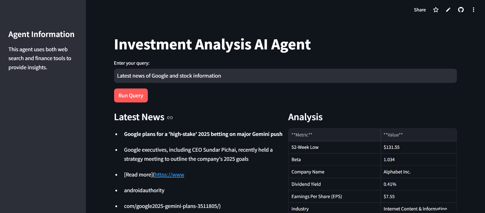

 This **Investment Analysis Bot** integrates live stock market data, analyst recommendations, and the latest company news to assist users in making informed investment decisions.

 **Key features of the project include:**

+ **Stock Market Analysis**: Retrieves and displays detailed analyst recommendations for publicly traded companies.
+ **Real-Time News Aggregation**: This feature fetches the latest news articles about selected companies to keep users updated on recent developments.
+ **Multi-Agent Collaboration**: combines multiple AI agents to handle specific tasks, such as web search and financial analysis, improving task-specific performance.

**Access the Bot**: https://invesmentanalysisbot-8bwimmbk3kgxnc5nbrbqh7.streamlit.app/#latest-news

